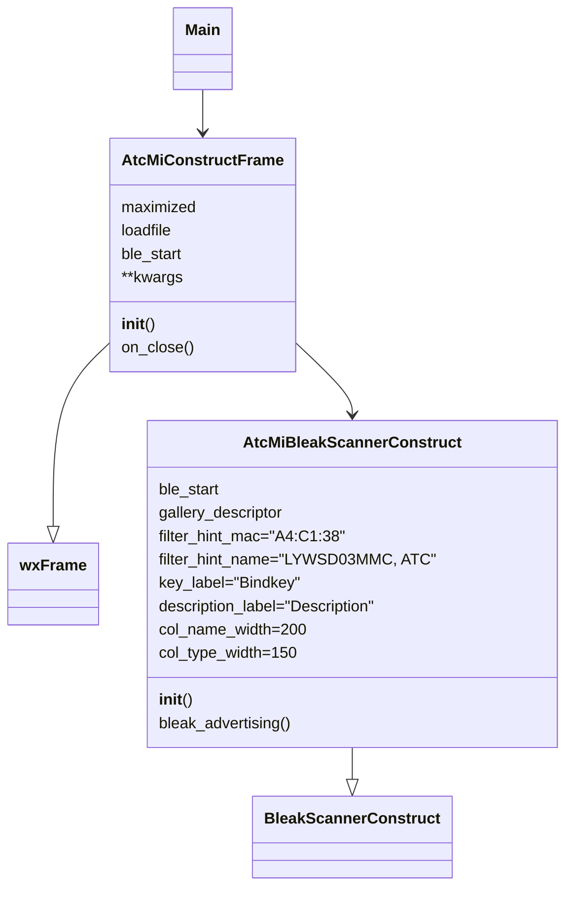
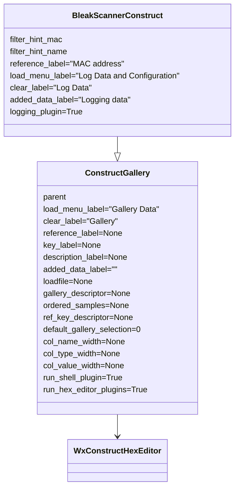
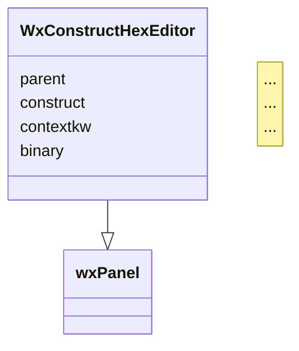

# Python interfacing methods and data representation model


These programs and descriptions are provided by [Ircama](https://github.com/Ircama).


This section provides Python components to represent the data model of the BLE advertisements produced by the custom firmware, as well as a documented interface and a testing tool to receive, decode, show and edit the BLE advertisements delivered via the custom firmware.


The base components used here are:

- [bleak](https://bleak.readthedocs.io/en/latest/), a cross-platform BLE library;
- [construct](https://construct.readthedocs.io/en/latest/intro.html), a symmetric Python library allowing to declaratively define a data structure that describes the advertisement frames produced by the custom firmware.
- [construct-gallery](https://github.com/Ircama/construct-gallery), a set of tools extending [construct-editor](https://github.com/timrid/construct-editor/), which provides a GUI (based on [wxPython](https://www.wxpython.org/)) for *construct*. All these tools are used here, including plugins and [bleak_scanner_construct.py](bleak_scanner_construct.py), a library to browse BLE advertisements.

The software in this section includes:

- a [*construct* data model](construct_atc_mi.py) representing the *custom*, *atc1441*, *mi_like* and *bt_home* formats, respectively in clear and encrypted structures.
- a [Python module to normalize *bleak* frames](atc_mi_adv_format.py) so that they can be directly processed by the *construct* library.
- an easy to use [BLE Advertisement Browser GUI](atc_mi_advertising.py) based on the [wxPython](https://www.wxpython.org/) cross-platform desktop GUI toolkit, including controls on the BLE advertisements, map MAC addresses, bindkeys, etc.


This GUI exploits the [construct-gallery](https://github.com/Ircama/construct-gallery) library, that extends the [Construct Editor](https://github.com/timrid/construct-editor/) library underneath.

## Decoding and encoding

The [construct_atc_mi.py](construct_atc_mi.py) module allows managing all data formats, including parsing frames to variables, building frames from variables, encrypting and decrypting using related keys and more. It relies on [construct_atc_mi_adapters.py](construct_atc_mi_adapters.py) that implements the custom adapters used by *construct_atc_mi.py*.

Install prerequisites:

```
python3 -m pip install construct pycryptodome
```

Parsing a [*custom* frame](https://github.com/pvvx/ATC_MiThermometer#custom-format-all-data-little-endian):

```python
from construct_atc_mi import general_format
print(general_format.parse(bytes.fromhex(
    '12 16 1a 18 5c c8 ee 38 c1 a4 b0 08 c3 14 ca 0a 50 14 05')))
```

Output:

```python
Container:
    version = 1
    custom_enc_format = ListContainer:
    custom_format = ListContainer:
        Container:
            version = 1
            size = 18
            uid = 22
            UUID = b'\x18\x1a' (total 2)
            MAC = u'A4:C1:38:EE:C8:5C' (total 17)
            mac_vendor = u'Telink Semiconductor' (total 20)
            temperature = 22.24
            temperature_unit = u'°C' (total 2)
            humidity = 53.15
            humidity_unit = u'%' (total 1)
            battery_v = 2.762
            battery_v_unit = u'V' (total 1)
            battery_level = 80
            battery_level_unit = u'%' (total 1)
            counter = 20
            flags = Container:
                humidity_trigger = False
                temp_trigger = False
                out_gpio_trg_flag = True
                out_gpio_trg_value = False
                input_gpio_value = True
    atc1441_enc_format = ListContainer:
    atc1441_format = ListContainer:
    mi_like_format = ListContainer:
    bt_home_format = ListContainer:
    bt_home_enc_format = ListContainer:
```

Parsing any type of format (*custom*, *atc1441*, *mi_like*, *bt_home*, either they are encrypted or not), automatically selected basing on the frame:

```python
from construct_atc_mi import general_format

frame1 = bytes.fromhex('12 16 1a 18 cc bb aa 38 c1 a4 77 07 88 13 ca 0a 50 01 07')

atc_mi_data = general_format.parse(frame1)

print("temperature:", atc_mi_data.search_all("^temperature"))
print("humidity:", atc_mi_data.search_all("^humidity"))
print("battery_level:", atc_mi_data.search_all("^battery_level"))
print("battery_v:", atc_mi_data.search_all("^battery_v"))

print()

frame2 = bytes.fromhex('16 16 1e 18 ec 12 cf e5 00 00 3a f3 95 3c a0 5a 7d 03 00 2a ea f8 ea')
bindkey = bytes.fromhex("AAAAAAAAAAAAAAAAAAAAAAAAAAAAAAAA")
mac_address = bytes.fromhex("A4:C1:38:AA:BB:CC".replace(':', ''))

atc_mi_data = general_format.parse(frame2, bindkey=bindkey, mac_address=mac_address)

print("temperature:", atc_mi_data.search_all("^temperature"))
print("humidity:", atc_mi_data.search_all("^humidity"))
print("battery_level:", atc_mi_data.search_all("^battery_level"))
print("battery_v:", atc_mi_data.search_all("^battery_v"))
```

Output:

```python
temperature: [19.11, '°C']
humidity: [50.0, '%', False]
battery_level: [80, '%']
battery_v: [2.762, 'V']

temperature: [20.0, '°C']
humidity: [50.0, '%']
battery_level: [100, '%']
battery_v: []
```

Alternatively to `general_format`, also `custom_format` can be used to decode *frame1* and `bt_home_enc_format` to decode *frame2* (after importing them).

Building the frame with the reverse process:

```python
from construct_atc_mi import custom_format

custom_format.build(
    {
        "size": 18,
        "uid": 22,
        "UUID": b"\x18\x1a",
        "MAC": "A4:C1:38:AA:BB:CC",
        "temperature": 19.11,
        "humidity": 50.0,
        "battery_v": 2.762,
        "battery_level": 80,
        "counter": 1,
        "flags": {
            "humidity_trigger": False,
            "temp_trigger": False,
            "out_gpio_trg_flag": True,
            "out_gpio_trg_value": True,
            "input_gpio_value": True,
        },
    }
).hex(' ')
```

Output:

```
'12 16 1a 18 cc bb aa 38 c1 a4 77 07 88 13 ca 0a 50 01 07'
```

## Encrypting and decrypting

All encoded versions of the structures (*custom_enc_format*, *atc1441_enc_format*, *bt_home_enc_format* and *mi_like_format* with encryption flag) support the following additional parameters:

- `mac_address`: MAC address in bytes (e.g., `bytes.fromhex("A4:C1:38:AA:BB:CC".replace(":", ""))`)
- `bindkey`: Bindkey in bytes (e.g., `bytes.fromhex("AAAAAAAAAAAAAAAAAAAAAAAAAAAAAAAA")`)

Alternatively (but not suggested), if the same MAC address and key are needed for all queries of a specific parser, the same parameters can be put in *construct_atc_mi.py* within the related `"codec"` adapter, like with the following:

```python
...
    "codec" / AtcMiCodec(
        Aligned(11,
            Struct(
                ...
            )
        ),
        size_payload=6,
        mac_address=bytes.fromhex("A4:C1:38:AA:BB:CC".replace(":", "")),
        bindkey=bytes.fromhex("AAAAAAAAAAAAAAAAAAAAAAAAAAAAAAAA")
    ),
)
```

Parsing example with `general_format`, that also includes encrypted formats like `custom_enc_format`:

```python
from construct_atc_mi import general_format

print(
    general_format.parse(
        bytes.fromhex("0e 16 1a 18 bd 9d c5 4e fa b5 00 0e 8b b8 07"),
        mac_address=bytes.fromhex("A4:C1:38:AA:BB:CC".replace(":", "")),
        bindkey=bytes.fromhex("AAAAAAAAAAAAAAAAAAAAAAAAAAAAAAAA"),
    )
)
```
    
Output:

```python
Container:
    version = 1
    custom_enc_format = ListContainer:
        Container:
            version = 1
            size = 14
            uid = 22
            UUID = b'\x18\x1a' (total 2)
            codec = Container:
                temperature = 19.11
                temperature_unit = u'°C' (total 2)
                humidity = 50.0
                humidity_unit = u'%' (total 1)
                battery_level = 93
                battery_level_unit = u'%' (total 1)
                flags = Container:
                    humidity_trigger = False
                    temp_trigger = True
                    out_gpio_trg_flag = True
                    out_gpio_trg_value = True
                    input_gpio_value = True
    custom_format = ListContainer:
    atc1441_enc_format = ListContainer:
    atc1441_format = ListContainer:
    mi_like_format = ListContainer:
    bt_home_format = ListContainer:
    bt_home_enc_format = ListContainer:
```

Building the frame with the reverse process:

```python
from construct_atc_mi import custom_enc_format

custom_enc_format.build(
    {
        "size": 14,
        "uid": 22,
        "UUID": b"\x18\x1a",
        "codec": {
            "temperature": 19.11,
            "humidity": 50.0,
            "battery_level": 80,
            "counter": 1,
            "flags": {
                "humidity_trigger": False,
                "temp_trigger": False,
                "out_gpio_trg_flag": True,
                "out_gpio_trg_value": True,
                "input_gpio_value": True,
            }
        }
    },
    mac_address=bytes.fromhex("A4:C1:38:AA:BB:CC".replace(":", "")),
    bindkey=bytes.fromhex("AAAAAAAAAAAAAAAAAAAAAAAAAAAAAAAA"),
).hex(' ')
```

Output:

```
'0e 16 1a 18 bd 9d c5 4e fa b8 08 56 6b e8 7f'
```

For the build process, generally `Container` is mapped to a dictionary (`{ ... }`), `ListContainer` to a list (`[ ... ]`) and `(enum)` with a normal `key: value` inside a dictionary (with the strings in quotes).

Another parsing example with `bt_home_enc_format`:

```python
from construct_atc_mi import bt_home_enc_format

print(
    bt_home_enc_format.parse(
        bytes.fromhex("16 16 1e 18 23 1b 90 11 7c cd e0 4b a1 73 26 5c 7d 03 00 68 8c 9b 84"),
        mac_address=bytes.fromhex("A4:C1:38:AA:BB:CC".replace(":", "")),
        bindkey=bytes.fromhex("AAAAAAAAAAAAAAAAAAAAAAAAAAAAAAAA"),
    )
)
```

Output:

```python
Container:
    version = 1
    size = 22
    uid = 22
    UUID = b'\x18\x1e' (total 2)
    codec = Container:
        count_id = 228700
        payload = ListContainer:
            Container:
                bt_home_type = (enum) BT_HOME_temperature 8962
                data = Container:
                    temperature = 19.11
                    temperature_unit = u'°C' (total 2)
            Container:
                bt_home_type = (enum) BT_HOME_humidity 771
                data = Container:
                    humidity = 50.0
                    humidity_unit = u'%' (total 1)
            Container:
                bt_home_type = (enum) BT_HOME_battery 513
                data = Container:
                    battery_level = 80
                    battery_level_unit = u'%' (total 1)
```

Reverse process:

```python
from construct_atc_mi import bt_home_enc_format

bt_home_enc_format.build(
    {
        "size": 22,
        "uid": 22,
        "UUID": b"\x18\x1e",
        "codec": {
            "count_id": 228700,
            "payload": [
                {
                    "bt_home_type": "BT_HOME_temperature",
                    "data": {"temperature": 19.11},
                },
                {
                    "bt_home_type": "BT_HOME_humidity",
                    "data": {"humidity": 50.0},
                },
                {
                    "bt_home_type": "BT_HOME_battery",
                    "data": {"battery_level": 80},
                }
            ]
        }
    },
    mac_address=bytes.fromhex("A4:C1:38:AA:BB:CC".replace(":", "")),
    bindkey=bytes.fromhex("AAAAAAAAAAAAAAAAAAAAAAAAAAAAAAAA"),
).hex(" ")
```

Output:

```
'16 16 1e 18 23 1b 90 11 7c cd e0 4b a1 73 26 5c 7d 03 00 68 8c 9b 84'
```

# Processing BLE advertisements

To process BLE advertisements, *bleak* is used, together with *atc_mi_advertising_format*. Install prerequisites with:

```
python3 -m pip install bleak construct pycryptodome
```

With Raspberry Pi, *bleak* requires *dbus-fast*, which needs to build the Python *wheel* (related compilation takes some time).

The simplest program to process BLE advertisements produced by the thermometers is the following:

```python
import asyncio
from bleak import BleakScanner
from functools import partial
from construct_atc_mi import general_format
from atc_mi_adv_format import atc_mi_advertising_format

bindkey = {
    "A4:C1:38:AA:BB:CC": bytes.fromhex("AAAAAAAAAAAAAAAAAAAAAAAAAAAAAAAA"),
    "A4:C1:38:AA:BB:00": bytes.fromhex("bbbbbbbbbbbbbbbbbbbbbbbbbbbbbbbb"),
    # ...
}

async def main():
    count = [0]
    stop_event = asyncio.Event()

    def detection_callback(count, device, advertisement_data):
        format_label, adv_data = atc_mi_advertising_format(advertisement_data)
        if not adv_data:
            return
        mac_address = bytes.fromhex(device.address.replace(":", ""))
        atc_mi_data = general_format.parse(
            adv_data,
            mac_address=mac_address,
            bindkey=bindkey[mac_address] if mac_address in bindkey else None
        )
        print(f"{count[0]}. {format_label} advertisement: {atc_mi_data}. "
            f"RSSI: {device.rssi}")
        count[0] += 1
        if count[0] == 5:
            stop_event.set()

    async with BleakScanner(
        detection_callback=partial(detection_callback, count)
    ) as scanner:
        await stop_event.wait()
    print("Stopped")


asyncio.run(main())
```

The program [runs on](https://github.com/hbldh/bleak#features) Windows, Linux, OS/X, Raspberry Pi, Android. It prints the first 5 parsed frames from available thermometers, regardless their configurations. It exploits `atc_mi_advertising_format()`, which adds headers to the BLE advertisements produced by the thermometers and discovered by `BleakScanner()` (from *bleak*), so that the resulting frame can be directly processed by the *construct* structures included in `construct_atc_mi`.

After the advertisement dump (e.g., before the *count* increment), you can optionally add:

```python
        print("temperature:", atc_mi_data.search_all("^temperature"))
        print("humidity:", atc_mi_data.search_all("^humidity"))
        print("battery_level:", atc_mi_data.search_all("^battery_level"))
        print("battery_v:", atc_mi_data.search_all("^battery_v"))
```

## BLE Advertisement Browser GUI

[atc_mi_advertising.py](atc_mi_advertising.py) is a Python GUI performing BLE advertisement analysis of data transmitted by thermometers, data editing and testing.

Activating this program and related prerequisites is optional.

Install prerequisites with the following command:

```bash
# Install prerequisites:
pip3 install -r requirements.txt
```

Additional prerequisites for Raspberry Pi:

```
sudo apt-get install -y libgtk-3-dev
python3 -m pip install attrdict
```

With Python 3.11 replace *attrdict* with *attrdict3*:

```
python3 -m pip uninstall attrdict
python3 -m pip install attrdict3
```

The C compiler is needed too.

To run the program:

```bash
# run program:
python3 atc_mi_advertising.py
```

Program command line options:

```
usage: atc_mi_advertising.py [-h] [-s] [-m] [-l LOG_DATA_FILE [LOG_DATA_FILE ...]] [-i]

optional arguments:
  -h, --help            show this help message and exit
  -s, --start           start BLE
  -m, --maximized       display the frame maximized
  -l LOG_DATA_FILE [LOG_DATA_FILE ...], --load LOG_DATA_FILE [LOG_DATA_FILE ...]
                        log data file(s) to be automatically loaded at startup.
  -i, --inspectable     enable Inspection

Xiaomi Mijia Thermometer - BLE Advertisement Browser
```

Main functionalities.
- BLE client to log, browse, test and edit advertisements produced by the Xiaomi Mijia Thermometers
- Cross-platform GUI
- The GUI includes a BLE control (implemented with buttons) which allows starting and stopping the BLE advertisement receiver. Advertisements are logged in their reception sequence, automatically labbelled basing on the discovered format and including related MAC address, so that they can be immediately selected by the user to browse and parse data.
- A filter button can be used to enter a specific MAC address to restrict logging, a portion of it or a sequence of addresses, as well as BLE local names.
- Logged data can be saved to file in [pickle format](https://docs.python.org/3/library/pickle.html). Archives can be subsequently reloaded and appended to the current log. They can also be inspected with `python -mpickle archive-file-name.pickle`.
- Advertisement data are logged in the left panel, shown as hex bytes in the central panel and then parsed to browsable *construct* structures in the right panel.
- The program uses `construct_atc_mi.py` to parse and build data and a special button allows dynamic reloading of this module, so that it can be easily edited, tested and tuned for new features.
- Everything is GUI based. Also the Python error management is wrapped into a GUI panel.
- A Python shell button allows opening an inspector shell, which also provides a special *Help* with related submenu (or by pressing F9).
- All panels allow a context menu (invoked with the right click of the mouse) with a number of special functions.
  - The left log menu panel allows renaming labels and changing MAC address, as well as its related bindkey and description. Also, by double clicking an unused area of the log panel, new frames can be added and then labelled; subsequently, a specific MAC address can be associated. For each MAC address the related bindkey and description can be edited. Log elements can be repositioned, or deleted.
  - The hex editor (central panel) allows any kind of copy/paste. Sequences of bytes can be pasted [in a number of different formats](https://github.com/timrid/construct-editor/pull/17#issuecomment-1367582581). Also a special checkbox enables pasting Python expressions. Two debugging tools are also provided (invoked with the right click of the mouse after selecting a sequence of bytes), to convert bytes into a wide set of numeric forms as well as strings; these debug panels can be used to quickly check the most appropriate conversion method for a sequence of bytes.
  - The construct right panel is also enriched by a right-click context menu controlling a number of features. Notice for instance the possibility to show hidden values, which are by default disabled.
- Encryption and decryprion are fully supported and a separate central panel in the lowest part of the screen shows the bytes produced by the related codec, mapping them with the referred structure in the right panel.
- The right panel allows changing all values (apart from the "Computed" ones) by double clicking the shown values, so that a new sequence of bytes is automatically built (including encryption when needed).
- A button shows a table allowing to edit MAC addresses and their related Bindkey and description.
- The program has command line arguments and one allows loading a saved log at startup; another option automatically starts the BLE advertisement receiver.
- When starting the BLE reception, a debug window is opened in background, with the possibility to control the debug level and clear the produced data.
- The `-i` command line option is for [debugging](https://wiki.wxpython.org/How%20to%20use%20Widget%20Inspection%20Tool%20-%20WIT%20%28Phoenix%29), which can be activated with Ctrl-Alt-I, or Cmd-Alt-I on Mac.

To check all available formats, run the following:

The stand-alone sample program [test_atc_formats.py](test_atc_formats.py) allows browsing all available formats, with samples. It consists of a very simple source code, which sets the *gallery_descriptor* variable and then calls *ConstructGallery* passing appropriate parameters. For instance, after running this program, included sample data can be saved to *all-formats.pickle* and then loaded with *atc_mi_advertising.py* via:

```bash
python3 atc_mi_advertising.py -m -l all-formats.pickle
```

### atc_mi_advertising.py

Technically, *atc_mi_advertising.py* is a very small and basic wrapper of the separate *construct-gallery* Python module, which does all the logic underneath. In turn, *construct-gallery*  relies on [construct-editor](https://github.com/timrid/construct-editor), a very powerful, well-designed and extensible module which implements all the construct editor widgets.



### construct-gallery module



### construct-editor module



## Connecting to a LYWSD03MMC thermometer via BLE

A simple program that connects to a LYWSD03MMC thermometer with native firmware and reads the parameters is the following:

```python
from bleak import BleakClient  # pip3 install bleak
from construct_atc_mi import native_temp_hum_v_values, native_comfort_values
import asyncio

mac_address = "A4:C1:38:AA:BB:CC"
valid_string_characteristics = [2, 13, 15, 17, 19, 21, 23, 95]
valid_bytes_characteristics = [26, 30, 33, 34, 36, 37, 57]
native_temp_hum_v_char = 53
native_comfort_char = 66

async def main(address):
    for times in range(20):
        try:
            async with BleakClient(address, timeout=60.0) as client:
                for service in client.services:
                    for char in service.characteristics:
                        name_bytes = await client.read_gatt_char(char)
                        if char.handle in valid_bytes_characteristics:
                            print(char.handle, service.description, "-", char.description, "- Value:", name_bytes.hex(' '))
                        if char.handle in valid_string_characteristics:
                            print(char.handle, service.description, "-", char.description, ":", name_bytes.decode())
                        if char.handle == native_temp_hum_v_char:
                            print(char.handle, char.description, ":", native_temp_hum_v_values.parse(name_bytes))
                        if char.handle == native_comfort_char:
                            print(char.handle, char.description, ":", native_comfort_values.parse(name_bytes))
                break
        except Exception as e:
            print(f"Retrying... ({e})")

asyncio.run(main(mac_address))
```

To run this program, flashing the custom firmware is not needed. Also, it does not rely on advertisements and performs a BLE connection (which discarges the battery). The address must be changed withe the actual MAC address.

With native LYWSD03MMC firmware, its output is:

```python
2 Generic Access Profile - Device Name : LYWSD03MMC
13 Device Information - Model Number String : LYWSD03MMC
15 Device Information - Serial Number String : ...
17 Device Information - Firmware Revision String : 1.0.0_0130
19 Device Information - Hardware Revision String : B1.7
21 Device Information - Software Revision String : 0130
23 Device Information - Manufacturer Name String : miaomiaoce.com
26 Battery Service - Battery Level - Value: 63
30 Unknown - OTA - Value: 00
34 Unknown - Time - Value: 9c 45 09 00
37 Unknown - Data Count - Value: a7 00 00 00 a8 00 00 00
53 Temperature and Humidity : Container:
    version = 1
    temperature = 19.1
    temperature_unit = u'°C' (total 2)
    humidity = 47
    humidity_unit = u'%' (total 1)
    battery_v = 2.983
    battery_v_unit = u'V' (total 1)
57 Unknown - Batt - Value: 64
66 comfortable temp and humi : Container:
    version = 1
    temperature_high = 27.0
    temperature_low = 19.0
    humidity_high = 85
    humidity_low = 20
    humidity_unit = u'%' (total 1)
95 Xiaomi Inc. - Version : 1.0.0_0130
```

In this simple program, some numeric values are not parsed.

With the custom firmware v4.1, its output is:

```python
2 Generic Access Profile - Device Name : ATC_AABBCC
13 Device Information - Model Number String : LYWSD03MMC
15 Device Information - Serial Number String : ...
17 Device Information - Firmware Revision String : github.com/pvvx
19 Device Information - Hardware Revision String : B1.7
21 Device Information - Software Revision String : V4.1
23 Device Information - Manufacturer Name String : miaomiaoce.com
26 Battery Service - Battery Level - Value: 64
30 Environmental Sensing - Temperature Celsius - Value: bf 00
33 Environmental Sensing - Temperature - Value: 76 07
36 Environmental Sensing - Humidity - Value: 76 11
```

In this simple program, the "Environmental Sensing" values are not parsed.

A more extensive program is [get_characteristics.py](get_characteristics.py), which parses all values.

```
Usage: python3 get_characteristics.py [-h] [-e] [-v] -m ADDRESS [-a ATTEMPTS]

optional arguments:
  -h, --help            show this help message and exit
  -e, --error           show error information
  -v, --verbosity       print process information
  -m ADDRESS, --mac ADDRESS
                        MAC Address
  -a ATTEMPTS, --attempts ATTEMPTS
                        max number of attempts (default=20)

Xiaomi Mijia Thermometer - List BLE Characteristics
```
